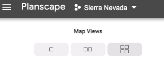
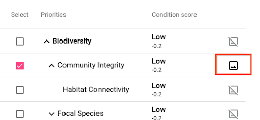

# Planscape User Guide

This topic contains the following sections:

*   [Introduction](#introduction)
*   [Users](#users)
    *   [User Types and Permissions](#user-types-and-permissions)
    *   [Registering as a user](#registering-as-a-user)
*   [Working with Planescape](#working-with-planescape)
    *   [Maps](#maps)
    *   [Plans](#plans)
    *   [Configurations](#configurations)
    *   [Scenarios](#scenarios)

## Introduction
Planscape is a landscape-scale decision support and collaboration tool that is intended to help land managers prioritize and manage a million acres annually by leveraging the latest data and climate models. Planscape intends to empower regional and forest unit planners such as resource managers, grant managers to prioritize resilience treatments across the landscape and fund the most impactful projects.

Planscape is an open source web based application that  provides a holistic view of resilience using the current climate change model and best available scientific data that enables you to do the following:

* Identify and choose problem areas
* Estimate and perform outcome analysis
* Communicate priorities with collaborators

Planscape uses an advanced scientific framework and data sources to bring you the data to visualize right information that will help you to make treatment decisions. See [Planscape: Scientific Framework and Data Sources](https://cawater.sharepoint.com/:w:/r/teams/CNRA_WFRPST/_layouts/15/Doc.aspx?sourcedoc=%7B078C6C9A-D820-4BFF-8C53-07EA63C971C8%7D&file=Scientific%20Framework%20and%20Data%20Sources.docx&_DSL=1&action=default&mobileredirect=true) for more information.

## Users
Planscape supports three types of users. You can be a guest user or a registered user.

* *Guest user* - As a guest user, you will have access to the tool in Guest Mode. You can explore and view the tool. The tool does not save your activities.
* *Registered user* - When you are a registered user, you are either a plan owner or a plan collaborator. You have access to all of the capabilities of the tool. And your work is autosaved every minute.
The autosave option saves the following information:
    * The screen you are in 
    * If you are exploring, 
        * Map view (1, 2, 4 view)
        * Map layers on for each map

### User Types and Permissions
<table border="1" cellspacing="1">
	<thead>
		<tr>
			<th scope="col">User</th>
			<th scope="col">Description</th>
			<th scope="col">Permission</th>
		</tr>
	</thead>
	<tbody>
		<tr>
			<td>Guest user</td>
			<td>&nbsp;</td>
			<td>View and explore options in the tool/td>
		</tr>
		<tr>
			<td>Plan owner</td>
			<td>The person who creates the plan</td>
			<td>
			<ul>
				<li>View, comment, and edit all editable plan details</li>
				<li>Share the plan with others</li>
				<li>Make the plan public</li>
				<li>Add/remove collaborators</li>
			</ul>
			</td>
		</tr>
		<tr>
			<td>Plan collaborator</td>
			<td>The person that the plan collaborator shares the plan with. There can be more than one plan collaborator to a plan.</td>
			<td>
			<ul>
				<li>View, comment plan</li>
				<li>Create scenarios. Cannot edit fields like plan name or planning area</li>
				<li>Add other collaborators. Cannot remove collaborators</li>
			</ul>
			</td>
		</tr>
	</tbody>
</table>

*Note:* The Plan Collaborator option is not ready in MVP. The options to make the plan public or share the plan with other collaborators will be included in the post MVP launch version.

### Registering as a user
By default, you are logged in as a Guest user in the tool. As a guest user, you can view and explore the options in the tool. When you attempt to create a plan, the tool requires you to register as a user. Only registered users can create and save a plan in the system.

## Working with Planescape
The MVP version of Planscape is built for the Sierra Nevada region. Click on the Sierra Nevada region to launch the Maps. 

### Maps
You can select different options in the Maps to review the region’s status of fire conditions and create a plan for treatment proposal. At any given time, you can choose to display a 1 or 2 or 4 Maps view on the screen by selecting one of the Map Views options.

_Figure 1:_ Map views 

Map controls are available on the map themselves or underneath the options. Ability to change the base map, and boundary layers. You can access Map controls on the maps or underneath the controls.

#### Base maps
The default option displays Roads. Select one of the other options to change the view.

#### Boundaries
The boundary layers are the predefined boundaries based on the data Planscape receives from different data sources. By default, the option is set to None. Select different options to change the map view.

#### Recent Treatment Areas
You can view existing projects in the CalMapper tool. When you are in the recent treatment areas, you can view a pop-up card that shows details of the project.

*Note:* This option changes after MVP.

_**Caution:** From **Boundaries**, if you select one of the **HUC** options, **Prescribed burns**, along with **Recent Treatment Areas > Existing Projects** in all four maps, the tool will have to handle very large datasets that may slow down the map._

#### Ecosystem Scores
Option not available in MVP. Planned for future versions of Planscape.

#### Current Condition
The Pillars and Elements options in **Current Conditions** are disabled by design. The data ranges for these options are in different data units and cannot be aggregate based on user options.  The overall Current Condition data is represented based on the most recent data from 2021. This data is set up based on the pillars of resilience. You can click Current Conditions to see the data.

*   The map legend shows the color range and data units. You have a opacity controller to view the underlying data
*   The icon layers provide more information into the data provider & source. You can click learn more to view the data dictionary of the data you are looking at. It gives how the data was collected and what the data you are viewing means.

#### Current Condition (Normalized)
After the data is normalized, Planscape can aggregate the data. You can select the Pillars or Elements from Normalized Current condition to view in the map for an area you have selected. In the Normalized value, the
*   Raw Values scaled linearly from –1 to 1.
*   Example: For the RV of large trees, 0 large trees is –1, 100 large trees is 1, and the midpoint of 50 is 0.

The other options on the Map screen such as **Disturbances**, **HVRAs**, **Land Types**, and **Operability** are planned for the next phase of Planscape development.

> If the map is slow to load, use one of the following two recommended options to improve loading time:
>   *    Turn off  Existing projects, HUC-12 boundary, Prescribed Burns boundary, and Fires boundary. These layers use more computer memory.So when you turn off, they loading time will improve.</li>
>   *   Switch to the One Map view - the leftmost icon above the map tabs on the panel

### Plans
From your region’s Maps view, you can create or upload a Plan. The plan you have created is also referred to as the Planning Area.

#### Creating a plan
1. Select a map from the Mapview and click **Create Plan > Draw an area**.
   
2. Click on the Map. See tooltip guidance to draw lines and click **Finish** to finish the drawing.
   
3. Click **Done** on the top right hand corner. **Start a new plan in this planning area?** dialog box pops up.
   
   **Note:** If you logged in as a Guest, you cannot save this plan. This screen will take you to the User Registration page. Register as a user to save your plan.

4. In the **Plan Name** field, enter a name for your plan and click **Confirm**.

Your plan is saved in the system. You can now configure options for a fire treatment and create a treatment scenario.

#### Updating a plan
TBD

### Configurations
For a plan you have created, you can select different priorities, constraints, and project areas to create configurations. Configurations are essentially drafts of scenarios that haven't been completed yet. Using these configurations, you can create a treatment scenario. Any plan can have multiple configurations and scenarios.

#### Select Priorities
Priorities are based on the Pillars of Resilience Framework. Only selected priorities are used to identify project areas and prioritize treatment.

**Note:** For the most accurate estimated outcome, choose no more than 5. When you select a top level **Pillar** for the priority, the **Elements** and **Metrics** below that pillar get grayed out. Because, the top level pillar selection creates an aggregation of data from all of the elements under the pillar.

For example, when you select Biodiversity, you are getting an aggregated view of the Biodiversity data as a whole. This does not mean you get to view data for each of the elements and pillars under biodiversity displayed together. If you want to view data for a specific element or metric under one of the pillars, such as Biodiversity, then you should select an element or metric under that pillar.

When you are in the Pillar selection, if you want to view how the map reflects your selection, click on the map icon to view the selection on the map.

_Figure 2:_ Select priorities map view

#### Select constraints
You need to set at least one of the constraints to create a configuration.
*   **Budget**:  A cost input is required. This is the estimated cost of treatment per acre. This helps to calculate a cost range for the whole plan based on acres treated.
*   **Other Constraints**

#### Identifying project areas
Planscape can identify a project area based on the defined configuration or you can upload a predefined project area by uploading shape files.

#### Generating scenarios
You can use Adjusting weights to define the relative priority or importance of your project and then generate scenarios based on that.

### Scenarios
Scenarios are generated by completed configurations. Scenarios contain project areas, total acreage, estimated cost range, and information about each project area, shape files to export, and a link to share the scenario directly.

#### Generating a Scenario
You can create a new configuration and then create a new scenario from that or use an already created configuration to create a new scenario.

To create a scenario from an existing configuration,
1. From the list of **Configurations**, select the one you want to use in your scenario.
   
2. Click **Continue Planning**.
   
3. If you need to still Set constraints and Identify Project areas, complete the selections.
   
4. In **Generate Scenarios**, adjust weights based on your requirements and click **Generate Scenario**.
   
   **Note:** When you click **Generate Scenario**, the tool handles a lot of data based on your priorities and constraints. This can take time. While the tool is generating your scenario, you can go back to review other plans, create new configurations or scenarios. When the scenario gets created, you can view it under **Saved Scenarios**.

   *    Exporting a plan
        *    Share a link to the plan
        *    Download the shapefiles for the planning area & metadata
        *    Controlling visibility:
             *    As a plan owner,  you control whether others can see your plans if they have the link or not. If they have full visibility, they can see all the scenarios you’ve created with links to more details about them and they can download the scenario’s shape files.
             *    If the plan or scenario is only “visible to you” then no one else can open the link.

